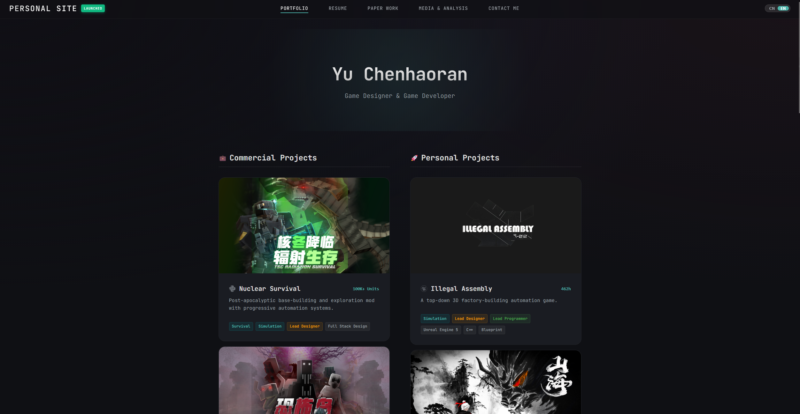

# ElectricArc Portfolio

> A professional, high-performance Game Designer Portfolio built with React, Vite, and TypeScript.
> 
> **Fork this repo to create your own portfolio in minutes!**



## ✨ Features

- **⚡️ High Performance**: Built with [Vite](https://vitejs.dev/) for instant dev server start and optimized production builds.
- **🌍 Built-in i18n**: Native Dual-Language support (Chinese/English) with instant switching. No complex libraries, just pure state management.
- **📱 Responsive & Premium**: Glassmorphism design system that looks great on Desktop, Tablet, and Mobile.
- **📝 Static CMS Architecture**: No database or backend required. All content is managed via strictly typed TypeScript files in `src/data`.
- **🎥 Media Rich**: Specialized support for Video Series, Podcasts, and embedded Game Mechanics showcases.
- **📄 Resume Integration**: Auto-formatting Digital Resume page generated from a data object.

## 🚀 Quick Start

### 1. Clone or Fork
Fork this repository to your own GitHub account, or clone it locally:
```bash
git clone https://github.com/ElectricArc-Yu/NeoPortfolio.git
cd NeoPortfolio
```

### 2. Enter the web directory
The source code is located in the `web` folder.
```bash
cd web
```

### 3. Install & Run
```bash
npm install
npm run dev
```
Open `http://localhost:5173` to see your portfolio live.

## 🎨 How to Make It Yours

This project is designed to be easily customizable. You don't need to be a React expert to update the content.

### 1. Update Project Info
Open `src/data/siteConfig.ts`:
```typescript
export const siteConfig = {
    header: {
        logo: "YourName", // Change top-left logo text
        // ...
    },
    footer: {
        owner: "Your Name",
        // ...
    }
}
```

### 2. Add Your Projects
Edit `src/data/projects.ts`. This is your "Database".
Add a new object to the `projects` list:
```typescript
{
    id: "my-game",
    titleCN: "我的游戏",
    titleEN: "My Awesome Game",
    type: "Personal",
    thumbnail: "src/assets/projects/my-game/thumb.jpg",
    // ...
}
```

### 3. Update Resume
Edit `src/data/resume.ts`. The Resume page will automatically layout whatever you put here.

### 4. Replace Assets
*   Put your images in `web/public/assets/`.
*   It is recommended to organize them like `web/public/assets/projects/[project-name]/`.

### 5. Define medias
Edit `src/data/medias.ts`. The Media page will automatically layout whatever you put here.

### 6. Set Main Project
Edit `src/data/siteConfig.ts`. The Main Project will as a collection of projects on the resume page.

### 7. Show your work
Edit `src/data/documents.ts`. The Documents page will automatically layout whatever you put here.

## 📦 Deployment

This project generates a static site, so it can be hosted anywhere (GitHub Pages, Vercel, Netlify).

### GitHub Pages (Recommended)

Just push to the 'master' branch, and GitHub Pages will automatically deploy the site.

## 📄 License

This project is open source. Feel free to use it as a template for your own portfolio!
